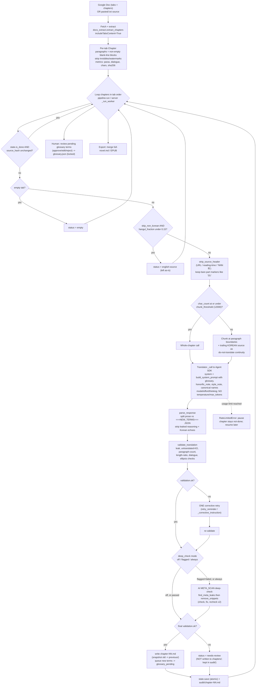

# Night Reader — Architecture & Translation-Quality Audit

> **Scope & method.** Read-only end-to-end audit of the Korean→English web-novel
> translator "Night Reader." Every claim below points to a real `path:line`. Prompt
> and config strings are quoted verbatim. The live translation pipeline was **not**
> run (it would spend Claude-subscription usage), so runtime claims are derived from
> code, config, and the 25 real projects already on disk. Findings were produced by
> direct reading of the core engine plus a 21-agent verification workflow (8
> translator's-lens dimensions each adversarially citation-checked, 4 subsystem
> sweeps, 1 completeness critic). Line numbers reflect the **current working tree**
> (see §Phase 6 — a large hardening pass is present on disk but uncommitted).

---

## 1. Overview

### What it is
A **local, single-user** app that translates Korean web novels into English using
**Claude via the Claude Agent SDK on the user's Claude subscription** (Max/Pro) — *not*
a paid API key ([README.md:8-11](../README.md#L8-L11), [translation_bot/translator.py:1-13](../translation_bot/translator.py#L1-L13)).
Novels are read from **Google Docs** (one chapter per tab), translated chapter by
chapter with a per-novel glossary, auto-validated, and saved as Markdown. A React UI
provides a library, reader, glossary review, and consistency tools.

### Languages detected
- **Source: Korean (Hangul).** Confirmed by the Hangul-detection utilities
  ([translation_bot/docs_extract.py:25-33](../translation_bot/docs_extract.py#L25-L33)),
  the "already-English" skip logic ([translation_bot/pipeline.py:173-183](../translation_bot/pipeline.py#L173-L183)),
  and the system prompt: *"You are translating a Korean web novel into high-quality English"* ([translation_bot/prompts.py:13](../translation_bot/prompts.py#L13)).
- **Target: English.** Output files, EPUB language `en` ([translation_bot/epub.py:100](../translation_bot/epub.py#L100)), and the prompt all target English.

### Stack
| Layer | Technology | Evidence |
|---|---|---|
| Translation engine | Python 3.11+, Claude **Agent SDK** (`claude_agent_sdk`) | [translation_bot/translator.py:24-34](../translation_bot/translator.py#L24-L34), [requirements.txt](../requirements.txt) |
| Model | `claude-opus-4-8` (default), effort `high`, adaptive thinking | [translation_bot/config.py:16-18](../translation_bot/config.py#L16-L18), [config.toml:5-7](../config.toml#L5-L7) |
| Config | TOML via stdlib `tomllib` + `pydantic` models | [translation_bot/config.py:1-93](../translation_bot/config.py#L1-L93) |
| Source ingestion | Google Docs API (`documents.get(includeTabsContent=True)`) + OAuth | [translation_bot/docs_extract.py:81-87](../translation_bot/docs_extract.py#L81-L87), [translation_bot/google_auth.py](../translation_bot/google_auth.py) |
| Backend | FastAPI + Uvicorn, Server-Sent Events for live progress | [server/app.py](../server/app.py), [launch.py:88-90](../launch.py#L88-L90) |
| Frontend | React + Vite + Tailwind | [web/package.json](../web/package.json), [README.md:127](../README.md#L127) |
| Storage | Per-project files under `projects/<id>/` (JSON + Markdown); no DB | [server/projects.py:1-30](../server/projects.py#L1-L30) |
| Job model | In-memory async workers; one per project; no queue persistence | [server/app.py:83-84](../server/app.py#L83-L84), [server/app.py:1430-1521](../server/app.py#L1430-L1521) |

### How it runs
- **App:** `python launch.py` (or `start.bat`) — ensures `config.toml`, builds the Vite
  frontend on first run, starts Uvicorn on `127.0.0.1:8000`, opens the browser
  ([launch.py:63-90](../launch.py#L63-L90)).
- **Headless CLI:** `python -m translation_bot {auth|extract|run|review|merge|status}`
  ([translation_bot/cli.py:1-10](../translation_bot/cli.py#L1-L10), [translation_bot/cli.py:159-182](../translation_bot/cli.py#L159-L182)).
- **Prerequisites:** Claude Code logged in (subscription), a Google OAuth
  `client_secret.json`, Python 3.11+, Node 18+ ([README.md:46-88](../README.md#L46-L88)).

### Real corpus (what's actually on disk)
25 projects, **1057 chapters**: `validated=1050`, `pending=5`, `needs-review=2`,
and **zero** `failed`/`english-source`/`empty`. Titles are predominantly BL/romance
web novels (e.g. *"Becoming the Top's Older Brother (공의 형이 된다는 건)"*). The near-100%
"green" rate is important context for the audit: the automated gates almost never
fail, because they check **structure**, not meaning (see §Phase 4).

---

## 2. Pipeline diagram



---

## 3. Phase-by-phase findings

### Phase 1 — Repo reconnaissance
- **Layout:** `translation_bot/` (engine), `server/` (FastAPI), `web/src/` (React),
  `projects/<id>/` (per-novel data), root config/launch/batch files.
- **Manifests/config:** `requirements.txt`, `web/package.json`, `config.toml`
  (live, git-ignored), `config.example.toml` (committed template), `client_secret.json`
  / `token.json` (Google OAuth). No `pyproject.toml`/`setup.py`/lockfile for Python.
- **Entry points:** GUI `launch.py`; CLI `translation_bot/__main__.py` →
  `cli.py:main`. The server is `server.app:app` ([launch.py:90](../launch.py#L90)).
- **Config precedence:** global `config.toml` → per-project overlay in
  `project_config` ([server/projects.py:300-318](../server/projects.py#L300-L318)).

### Phase 2 — Tech stack & dependencies
- **LLM provider:** Anthropic **Claude via the Agent SDK**, authenticated by the
  user's **subscription** (no API key, no per-call billing). Rate-limit exhaustion is
  caught as `RateLimitedError` and pauses the run cleanly
  ([translation_bot/translator.py:61-74](../translation_bot/translator.py#L61-L74), [translation_bot/translator.py:229-246](../translation_bot/translator.py#L229-L246)).
- **Model routing:** full ids are mapped to the SDK alias (`opus`/`sonnet`/`haiku`)
  by `_agent_model` ([translation_bot/translator.py:87-96](../translation_bot/translator.py#L87-L96)).
- **Tools:** all agent tools are **blocked** for a clean text-in/text-out call
  (`WebSearch` allowed only if `web_access=true`) ([translation_bot/translator.py:44-48](../translation_bot/translator.py#L44-L48), [translation_bot/translator.py:203-216](../translation_bot/translator.py#L203-L216)).
- **HTTP layer:** Google Docs via `googleapiclient`; Claude via the SDK's own
  transport. **Storage:** flat per-project JSON + Markdown; **no DB, no cache, no job
  queue** (jobs are in-memory only, [server/app.py:83-84](../server/app.py#L83-L84)).

### Phase 3 — The translation pipeline, end to end

1. **Ingestion.** Primary source is a **Google Doc**, one **top-level tab per
   chapter**, fetched with `includeTabsContent=True`; nested child tabs are flattened
   depth-first ([translation_bot/docs_extract.py:139-155](../translation_bot/docs_extract.py#L139-L155)).
   Text is UTF-8; paragraphs are the non-empty text runs of each doc paragraph, with
   tables recursed into ([translation_bot/docs_extract.py:90-123](../translation_bot/docs_extract.py#L90-L123)).
   Zero-width/watermark characters are stripped at extraction
   ([translation_bot/docs_extract.py:37-49](../translation_bot/docs_extract.py#L37-L49)). A second source path
   accepts pasted text / `.txt` split by separator, heading, or single-chapter
   ([translation_bot/text_source.py:62-132](../translation_bot/text_source.py#L62-L132)).
2. **Chapter detection & skip logic.** Blank tabs → `empty`; tabs below
   `min_hangul_fraction` (0.15) → `english-source` (left untranslated); already-done
   chapters with an unchanged `sha256` source hash are skipped
   ([translation_bot/pipeline.py:164-184](../translation_bot/pipeline.py#L164-L184), [translation_bot/pipeline.py:308-311](../translation_bot/pipeline.py#L308-L311)).
3. **Preprocessing.** `strip_source_header` removes leading export cruft (ridibooks
   URLs, "4-5 minutes" reading-time, "NNN화"/"Chapter N") but **deliberately keeps**
   bare in-story part markers like `33.` ([translation_bot/sanitize.py:107-131](../translation_bot/sanitize.py#L107-L131)). The
   original hash is retained so preprocessing doesn't force re-translation
   ([translation_bot/pipeline.py:185-193](../translation_bot/pipeline.py#L185-L193)).
4. **Chunking.** **Whole-chapter by default** (preserves voice); only chapters over
   `chunk_threshold` (12000 non-space Korean chars) are split at paragraph
   boundaries. Chunks do **not** overlap; continuity is the previous chunk's trailing
   `continuity_paragraphs` (3) of **Korean source**, explicitly marked
   *do-not-translate* ([translation_bot/translator.py:160-191](../translation_bot/translator.py#L160-L191), [translation_bot/translator.py:299-319](../translation_bot/translator.py#L299-L319)).
5. **The translation call.** `build_system_prompt` injects the relevant glossary,
   `honorific_note`, `style_note`, and canonical names; the user message wraps the
   source ([translation_bot/translator.py:269-297](../translation_bot/translator.py#L269-L297)). Options: `model`, `effort`,
   `thinking` — **no temperature, no max_output_tokens** are forwarded
   ([translation_bot/translator.py:203-216](../translation_bot/translator.py#L203-L216)). Full prompts in §4.
6. **Response parsing.** Output is split on `===NEW_TERMS===`; prose has leaked
   reasoning and whole-paragraph Korean echoes stripped; the trailing JSON becomes
   proposed glossary terms ([translation_bot/translator.py:122-157](../translation_bot/translator.py#L122-L157)).
7. **Terminology / glossary.** `glossary.json` is the locked source of truth. Only
   entries whose **Korean term is a substring** of the chapter appear in that
   chapter's prompt ([translation_bot/glossary.py:109-112](../translation_bot/glossary.py#L109-L112)); English-only "canonical
   names" are injected as spellings-to-match ([translation_bot/glossary.py:114-122](../translation_bot/glossary.py#L114-L122)).
   New terms are **never auto-committed** — they go to a pending queue behind a human
   approve/edit/reject gate ([translation_bot/glossary.py:223-263](../translation_bot/glossary.py#L223-L263), [translation_bot/cli.py:101-156](../translation_bot/cli.py#L101-L156)).
8. **Cross-chunk / cross-chapter memory.** Carried across calls: glossary + canonical
   names + `honorific_note` + `style_note`. **Not carried:** any prior chapter prose,
   a running summary, prior English translation, or a style guide beyond `style_note`
   ([translation_bot/translator.py:277-283](../translation_bot/translator.py#L277-L283), [translation_bot/pipeline.py:108](../translation_bot/pipeline.py#L108)).
9. **Postprocessing.** Chunks are re-joined with `\n\n`; curly quotes are preserved
   (no smart-quote normalization); the previous translation is snapshotted to
   `previous/` before overwrite ([translation_bot/pipeline.py:35-50](../translation_bot/pipeline.py#L35-L50), [translation_bot/pipeline.py:321-323](../translation_bot/pipeline.py#L321-L323)).
   **No romanization transform is applied** anywhere (see §5).
10. **Output.** Validated chapters → `projects/<id>/chapters/chapter-NN.md`; every
    chapter (pass or fail) → `audit/chapter-NN.md` with source + translation + metrics
    ([translation_bot/pipeline.py:58-97](../translation_bot/pipeline.py#L58-L97), [translation_bot/pipeline.py:204-208](../translation_bot/pipeline.py#L204-L208)). Export to merged Markdown
    ([translation_bot/pipeline.py:368-382](../translation_bot/pipeline.py#L368-L382)) or EPUB ([translation_bot/epub.py:72-148](../translation_bot/epub.py#L72-L148)).
11. **Error handling / retries / rate limits.** SDK connection errors retry with
    exponential backoff (`api_retry_count=4`) ([translation_bot/translator.py:254-267](../translation_bot/translator.py#L254-L267)); a
    **truncated stream** (no `ResultMessage`) raises rather than saving partial prose
    ([translation_bot/translator.py:245-251](../translation_bot/translator.py#L245-L251)); one bad chapter never crashes the run
    ([translation_bot/pipeline.py:325-334](../translation_bot/pipeline.py#L325-L334)); rate-limit exhaustion pauses and resumes
    ([translation_bot/pipeline.py:317-324](../translation_bot/pipeline.py#L317-L324)). A **partial/failed run** leaves validated
    chapters written, suspect ones as `needs-review` (in `audit/`, not `chapters/`),
    and everything else resumable.
12. **Caching.** No translation cache. "Skip if done" is keyed on
    `status == validated` **AND** matching source `sha256`
    ([translation_bot/state.py:68-74](../translation_bot/state.py#L68-L74)) — effectively an idempotency guard, not a cache.

### Phase 4 — Translator's-lens audit

Each dimension below was independently reviewed and then adversarially
citation-verified. Verdicts: **7 CONFIRMED, 1 REVISED, 0 REFUTED.**

The **verbatim** system-prompt clauses that matter here:
- *"Render meaning naturally rather than word-for-word... smooth, readable,
  native-sounding English. Use contractions."* ([translation_bot/prompts.py:17](../translation_bot/prompts.py#L17))
- *"Keep relational honorifics like -hyung (and similar) attached to names. Localize
  or drop the address particles -ssi, -ya, -ah, and -nim into natural English rather
  than romanizing them."* ([translation_bot/prompts.py:30-31](../translation_bot/prompts.py#L30-L31))
- *"no translator's notes, no glossary inside the prose."* ([translation_bot/prompts.py:36](../translation_bot/prompts.py#L36))

| # | Dimension | Handling | Risk | One-line verdict |
|---|---|---|---|---|
| 4.1 | Honorifics & speech levels (존댓말/반말, 하십시오체/해요체) | **mixed** | **high** | Address particles handled; the **speech-level / inter-speaker register axis is entirely unaddressed** in the prompt. |
| 4.2 | Subject/pronoun omission & gender inference | **mixed** | **medium** | The pronoun/register anchor is wired but **dormant (0/1275 populated)** and never auto-filled; prompt gives no dropped-subject guidance. |
| 4.3 | Name & romanization consistency | **mixed** | **medium** (REVISED) | Locked-glossary + canonical-names + human gate protect established names well; **romanization scheme is a dead knob**; substring matching is fragile. |
| 4.4 | Sentence-final particles, nuance, tone | **fragile** | **medium** | Prompt never names -네/-군/-지/-잖아/-더라 nuance; left entirely to model discretion. |
| 4.5 | Onomatopoeia / mimetics (의성어·의태어) | **mixed** | **medium** | No rendering guidance; a whole-paragraph repeated SFX can be silently deleted; SFX-dense retained Korean can trip the untranslated-KO hard-fail. |
| 4.6 | Culture-specific address terms & titles (오빠/누나/형/선배/선생님, foods) | **mixed** | **medium** | Only name-attached suffixes covered; standalone vocatives/foods/titles get **zero** rule, and translator's notes are banned. |
| 4.7 | Long run-on sentences vs English rhythm | **mixed** | **medium** | Sentence-splitting is safe, but **paragraph reflow can hard-fail the paragraph-count check** and the retry pushes back to source parity. |
| 4.8 | Character voice consistency across the book | **fragile** | **medium** | No cross-chapter memory (no summary/prior prose); whole-chapter calls stabilize voice only *within* a chapter. |

**4.1 Honorifics & speech levels — mixed / high.** The prompt's honorific rule
([translation_bot/prompts.py:30-31](../translation_bot/prompts.py#L30-L31)) and the default `honorific_note`
([translation_bot/config.py:54-57](../translation_bot/config.py#L54-L57)) cover **only** address particles/vocatives.
A grep of `prompts.py` finds **no** mention of speech levels, register, 존댓말/반말, or
하십시오체/해요체 anywhere. The one register-carrying channel — `GlossaryEntry.register`
([translation_bot/glossary.py:39](../translation_bot/glossary.py#L39)) rendered as a bare `[register: …]` tag by
`_profile_hint` ([translation_bot/glossary.py:176-183](../translation_bot/glossary.py#L176-L183)) and injected via
`format_injection`/`format_names` — **reaches the prompt but is never explained to the
model**, and the block it sits in only says *"locked reference, do not change these
spellings"* ([translation_bot/prompts.py:32](../translation_bot/prompts.py#L32)). Net: a single static per-character tag
cannot encode "A speaks banmal *down* to B but jondaemal *up* to C," and even that
tag is unpopulated in practice (§Phase 4 data).

**4.2 Pronoun omission & gender — mixed / medium.** Korean drops subjects, so
wrong-gender/wrong-referent is the classic failure. The data model *correctly* carries
`pronoun`/`register` anchors with a comment that diagnoses exactly this
([translation_bot/glossary.py:35-39](../translation_bot/glossary.py#L35-L39)), and `_profile_hint` is wired into **both**
injection paths ([translation_bot/glossary.py:191](../translation_bot/glossary.py#L191), [translation_bot/glossary.py:202](../translation_bot/glossary.py#L202)). But: (a) **no path
auto-populates it** — the NEW_TERMS schema ([translation_bot/prompts.py:37](../translation_bot/prompts.py#L37)), the
`NAME_EXTRACTION_PROMPT` ([translation_bot/prompts.py:59-70](../translation_bot/prompts.py#L59-L70)), and `extract_glossary`'s
hard-coded output dict ([translation_bot/translator.py:361-365](../translation_bot/translator.py#L361-L365)) all emit only
`english/type/note`; (b) the system prompt never tells the model that Korean drops
subjects or that it must hold gender/referent consistent — the only consistency clause
is about spellings ([translation_bot/prompts.py:29](../translation_bot/prompts.py#L29)). **Real evidence:** glossary `note`
fields contain gender cues (e.g. *"father of the six children"*) yet `pronoun` is
empty on **all 1275 entries** — the info exists but is never captured where the prompt
would use it.

**4.3 Name & romanization consistency — mixed / medium (REVISED).** Established-name
consistency is *soundly* protected: the locked-glossary block
([translation_bot/prompts.py:32](../translation_bot/prompts.py#L32)), the be-consistent instruction
([translation_bot/prompts.py:29](../translation_bot/prompts.py#L29)), the canonical-names block
([translation_bot/prompts.py:101-104](../translation_bot/prompts.py#L101-L104)), and the human-gated pending queue
([translation_bot/glossary.py:223-263](../translation_bot/glossary.py#L223-L263)). Two real weaknesses: (a) **romanization is a dead
knob** — `romanization = "Revised Romanization (RR)"` ([config.toml:35](../config.toml#L35),
[translation_bot/config.py:47](../translation_bot/config.py#L47)) is **never read** by `build_system_prompt` or
`translator`; the word appears in a prompt only to be *removed* (META_SCAN,
[translation_bot/prompts.py:49](../translation_bot/prompts.py#L49)). So a name's first-appearance spelling is the
model default, then locked. (b) `relevant_to` uses a **boundary-less substring test**
(`e.korean in source_text`, [translation_bot/glossary.py:111](../translation_bot/glossary.py#L111)) — a 1-2 syllable Korean
term can mis-hit inside a longer word.

**4.4 Sentence-final particles & tone — fragile / medium.** Particles
(-네/-군/-지/-잖아/-더라) encode mirative/evidential/agreement-seeking attitude with no
lexical English equivalent, and the prompt **never names the phenomenon**. Its only
tone-adjacent guidance is the generic *"render meaning naturally... use contractions"*
([translation_bot/prompts.py:17](../translation_bot/prompts.py#L17)). Left entirely to model discretion.

**4.5 Onomatopoeia / mimetics — mixed / medium.** No prompt rule addresses 의성어·의태어
(the only mentions are opt-in examples in a config docstring
[translation_bot/config.py:52-53](../translation_bot/config.py#L52-L53) and a UI hint). The strip logic is *protective by
design* — `_is_korean_echo` requires **both** >8 Hangul chars **and** >0.5 fraction
([translation_bot/sanitize.py:79-82](../translation_bot/sanitize.py#L79-L82)), so short SFX (쿵!, 두근두근) survive. But two edge
cases remain: (a) a whole-paragraph long repeated SFX (e.g. 두근두근두근두근두근, ~10
Hangul, fraction ~1.0) is silently removed by `remove_korean_echoes`
([translation_bot/sanitize.py:134-145](../translation_bot/sanitize.py#L134-L145)); (b) a chapter that intentionally keeps Korean
mimetics can exceed the global `korean_fraction > 0.10` **hard-fail**
([translation_bot/validate.py:63-64](../translation_bot/validate.py#L63-L64)) and be wrongly flagged.

**4.6 Culture-specific address terms & titles — mixed / medium.** The prompt gives
explicit, configurable guidance for exactly **one** case: relational **suffixes
attached to names** ([translation_bot/prompts.py:30](../translation_bot/prompts.py#L30)). A grep confirms **nothing** about
free-standing vocatives (오빠/누나/형/언니/선배/후배/선생님 used as address on their own),
foods, or titles. With no rule, the *"render naturally"* default
([translation_bot/prompts.py:17](../translation_bot/prompts.py#L17)) flattens 오빠 to "brother"/name — erasing the
brother-vs-boyfriend romance signal that matters in this app's BL/romance corpus — and
the **translator's-note ban** ([translation_bot/prompts.py:36](../translation_bot/prompts.py#L36)) removes the usual gloss
escape hatch.

**4.7 Run-on sentences vs English rhythm — mixed / medium.** Splitting a long Korean
run-on **sentence** into several English sentences is fully safe: `_paragraphs` splits
only on blank lines ([translation_bot/validate.py:27](../translation_bot/validate.py#L27)) and the ratio uses non-space chars
([translation_bot/validate.py:30-31](../translation_bot/validate.py#L30-L31)). Friction is at the **paragraph** level: reflowing a
Korean wall-of-text paragraph into two or three English paragraphs — which the prompt
*invites* (*"Format the chapter to read attractively and clearly"*,
[translation_bot/prompts.py:26](../translation_bot/prompts.py#L26)) — raises `out_para_count`; once drift exceeds
`para_tol = max(2, round(5% of source))` it is a **hard fail**
([translation_bot/validate.py:68-73](../translation_bot/validate.py#L68-L73)), firing one retry whose reminder commands *"Match
the source paragraph by paragraph"* ([translation_bot/translator.py:50-54](../translation_bot/translator.py#L50-L54)) — pushing a
rhythm-driven restructurer back toward source (wall-of-text) parity. **Production
proof:** the *only two* real `needs-review` chapters (project `2abca73014be` ch16 &
ch50) failed on **paragraph count alone** (103 vs 26; 331 vs 634) with length-ratio
comfortably in-band (2.62, 2.43) — clean output routed to manual review by structural
segmentation, not mistranslation.

**4.8 Character voice consistency — fragile / medium.** There is **no cross-chapter
voice memory**: `translate_chapter` threads only glossary/canonical-names/honorific_note/
style_note ([translation_bot/translator.py:277-283](../translation_bot/translator.py#L277-L283)); `pipeline.py:108` recomputes the
relevant glossary from the *current* chapter alone. `include_prev_translation` is a
**dead knob** (declared [translation_bot/config.py:46](../translation_bot/config.py#L46), advertised
[config.example.toml:33](../config.example.toml#L33), read nowhere). The whole-chapter-in-one-call
default ([translation_bot/translator.py:290](../translation_bot/translator.py#L290)) stabilizes voice **only within a chapter**;
across a long serial, idiolect/rhythm/verbal-tics are re-derived each chapter.

**Additional un-audited gaps (no dimension, no prompt rule):** four-character idioms /
proverbs / wordplay (사자성어), and Korean counters / native-vs-Sino numerals — neither
is mentioned anywhere in `SYSTEM_PROMPT_TEMPLATE` ([translation_bot/prompts.py:12-41](../translation_bot/prompts.py#L12-L41)).

### Phase 5 — Config & tunables
See the reference table in §5 below. Key structural facts:
- **Global vs per-project.** `project_config` overlays only `style_note`,
  `instructions`→`extra_instruction`, and `honorific_note`; **model, effort,
  deep_check, chunk_threshold, and all validation thresholds stay global**
  ([server/projects.py:300-318](../server/projects.py#L300-L318)).
- **UI-writable knobs are only three:** `model`, `effort`, `deep_check`
  ([server/app.py:310-313](../server/app.py#L310-L313), [server/app.py:329-360](../server/app.py#L329-L360)); `chunk_threshold` and the length
  ratios are shown read-only, everything else is config-file-only.
- **Live vs example drift:** `config.toml` ships `deep_check = "always"`
  ([config.toml:31](../config.toml#L31)) while the example ships `"flagged"`
  ([config.example.toml:39](../config.example.toml#L39)) — the live default spends an extra Claude
  call on **every** chapter.

### Phase 6 — Known-issue reconnaissance
- **Git history (7 commits).** The dominant recurring problem across history is **AI
  "thinking out loud" leaking into prose**; ~4 commits progressively added defenses
  (prompt "no thinking in the output" rule, `sanitize.py` leak-stripping, a
  `validate.py` hard-fail leak check, the AI META_SCAN deep-check, and source-header /
  Korean-echo stripping). Two other arcs: genre framing was **de-hardcoded** from
  *"boy's love web novel"* to a configurable `style_note` (commit `46e44b2`), and
  **canonical-name injection** was added for cross-chapter consistency (commit
  `ae89b93`).
- **No TODO/FIXME/HACK markers** exist in the code, and **no tests exist anywhere** —
  no `pytest`/`vitest`/`jest` config, no `test_*.py`, and `web/package.json` defines
  only `dev`/`build`/`preview`. The prose-**deleting** sanitizer regexes
  (`_ALWAYS`/`_SELF`/`_ARROW`, [translation_bot/sanitize.py:22-67](../translation_bot/sanitize.py#L22-L67)) and the validation
  thresholds have **zero regression coverage**.
- **Large uncommitted hardening pass.** `git status` shows 17 modified files. The
  **current working tree already fixes** several real bugs that the committed code
  still has: the truncated-output guard ([translation_bot/translator.py:245-251](../translation_bot/translator.py#L245-L251)),
  atomic glossary/state/project writes ([translation_bot/glossary.py:20-26](../translation_bot/glossary.py#L20-L26)), narrowed
  prose-deleting regexes ([translation_bot/sanitize.py:54-67](../translation_bot/sanitize.py#L54-L67)), and widened Hangul
  detection ([translation_bot/docs_extract.py:25](../translation_bot/docs_extract.py#L25)). These are **present on disk but not
  committed** — a real risk of loss/partial-apply, but *not* active defects in the
  code that runs today.
- **Data artifacts.** One `projects/19d3e2dce082/state.json.corrupt-backup` (1037
  bytes of whitespace) — evidence a state write was corrupted once and quarantined;
  the atomic-write path ([translation_bot/state.py:52-63](../translation_bot/state.py#L52-L63)) is designed to prevent
  recurrence. Several projects keep `previous/` and `chapters_preclean_backup/`
  snapshot dirs.
- **Docs:** `README.md` and `THEMING.md` carry no known-issue/limitations list; git
  history is effectively the only issue tracker.

---

## 4. The prompts, verbatim — with a literary-translation critique

### 4.a System prompt (the template)
Source: [translation_bot/prompts.py:12-41](../translation_bot/prompts.py#L12-L41). `{...}` placeholders are filled by
`build_system_prompt` ([translation_bot/prompts.py:73-113](../translation_bot/prompts.py#L73-L113)).

```text
You are an expert literary translator who adapts web novels into dynamic, natural, native-English web-novel prose. You are translating a Korean web novel into high-quality English. Output clean Markdown.
{style_note_line}
**Fidelity (highest priority):**
- Translate completely. Do not omit or condense any sentence, phrase, or detail, however small. Do not embellish or add anything not in the source.
- Render meaning naturally rather than word-for-word. Proofread, edit, and rephrase as needed for smooth, readable, native-sounding English. Use contractions.
- Preserve standalone section/part markers: if a line in the source contains ONLY a number such as `33.`, keep it exactly, on its own line, in the same position. These are the author's part dividers — never drop them as noise and never translate them away.

**Style & formatting:**
- Use "" (curly double quotes) for speech; do not change, censor, or normalize them to straight quotes.
- Use italics (`*...*`) for internal thoughts and similar.
- Use ellipses of exactly three dots (`...`); fix any that differ.
- Avoid em dashes (none, or as few as possible). Use hyphens for stutters (e.g., "I-I see").
- Punctuate correctly, with special attention to question marks.
- Format the chapter to read attractively and clearly.

**Names & honorifics:**
- Use the glossary's spellings and choices exactly; be fully consistent with established names and terms.
- Keep relational honorifics like -hyung (and similar) attached to names. Localize or drop the address particles -ssi, -ya, -ah, and -nim into natural English rather than romanizing them.
{honorific_note_line}**Glossary — locked reference, do not change these spellings:**
{glossary_block}
{names_section}
**Output contract:**
1. First, the translated chapter as clean Markdown prose only — no translator's notes, no glossary inside the prose.
2. Then a line containing only `{delimiter}`, followed by a JSON array of names/terms newly encountered in this chapter that are not already in the glossary: `[{"korean": "...", "english": "...", "type": "name|place|skill|term|other", "note": "..."}]`. If none, output `[]`. Output nothing after this block.

**CRITICAL — no thinking in the output.** Do all reasoning, name-checking, and self-correction silently (in your private thinking), never in the answer. The prose section must contain ONLY the finished translated chapter. Never write meta-commentary such as "Wait", "Let me redo", "Let me re-read", "Actually the name is…", "the narrator is…", "the glossary says…", or a first draft followed by a corrected one. If you change your mind about a name or wording, output only the final corrected text — no drafts, no notes, no "---" separating attempts.
{web_access_line}
```

**What it does well (translator's lens):**
- Puts **fidelity first** and *explicitly bans omission/condensation and embellishment*
  — the right primary instinct for literary web-novel work.
- Correctly separates **fidelity of meaning** from **naturalness of English** (*"render
  meaning naturally rather than word-for-word... use contractions"*), which discourages
  translationese.
- **Locks names to the glossary** and demands consistency — the single most important
  lever for a long serial.
- Sensible **typographic house style** (curly quotes, three-dot ellipses, italics for
  thought, stutter hyphens) that matches web-novel reader expectations.
- The **structured new-terms output contract** is a clean way to grow terminology.
- The **anti-"thinking-in-output"** clause is well-targeted at a real, observed failure
  (leaked reasoning).

**Where it is weak (translator's lens):**
- **No speech-level / register guidance.** Nothing about 존댓말/반말, 하십시오체/해요체, or how
  register *differs between speakers*. In a BL/romance corpus this is a first-order
  quality axis, and it is silent (§4.1).
- **No dropped-subject / pronoun-consistency instruction.** Korean omits subjects; the
  prompt never tells the model to infer and *hold gender/referent consistent* (§4.2).
- **No sentence-final-particle / nuance guidance** (§4.4); **no onomatopoeia rule**
  (§4.5); **no standalone-vocative or culture-term policy** (오빠/누나/선배/foods) (§4.6);
  **no idiom/proverb/counter guidance** (Phase 4 gaps).
- **`romanization` is advertised in config but never enters this prompt** — the injected
  honorific rule romanizes `-hyung` but no scheme (RR) governs new names (§4.3, §5).
- The **translator's-note ban** (item 1) is right for clean prose but removes the only
  natural escape hatch for an untranslatable address term — combined with the missing
  vocative policy, ambiguous terms must resolve inline or be lost (§4.6).
- **`{style_note}` and the register hints are the only per-work levers, and both are
  empty in 100% of real projects** — so in practice every novel runs this one neutral
  prompt (§Phase-4 data, §6-Risk-5).

### 4.b Injected blocks
- **Glossary block** — `format_injection`: `- <korean> -> <english> (<type>) [pronoun:
  …; register: …] — <note>` ([translation_bot/glossary.py:186-193](../translation_bot/glossary.py#L186-L193)). The `[register: …]`
  hint reaches the model but has **no directive telling it what to do with it**.
- **Canonical-names block** — injected as *"use these EXACT English spellings whenever
  the corresponding person, place, or term appears, even if it is not in the glossary
  above"* ([translation_bot/prompts.py:101-104](../translation_bot/prompts.py#L101-L104)).

### 4.c Auxiliary prompts (also verbatim in source)
- **`META_SCAN_PROMPT`** ([translation_bot/prompts.py:44-56](../translation_bot/prompts.py#L44-L56)) — the AI deep-check that
  finds stray non-story text (preambles, notes, untranslated Korean, `X -> Y` mappings)
  and returns verbatim substrings to delete. Good defense-in-depth; note it treats any
  romanization mapping as *garbage to remove*, reinforcing that no romanization scheme
  is intended in output.
- **`NAME_EXTRACTION_PROMPT`** ([translation_bot/prompts.py:59-70](../translation_bot/prompts.py#L59-L70)) — seeds a glossary from
  already-English chapters; **emits only `english/type/note`** — a root cause of the
  empty `pronoun`/`register` fields (§4.2).
- **`_RETRY_REMINDER`** ([translation_bot/translator.py:50-54](../translation_bot/translator.py#L50-L54)) and server
  `_corrective_instruction` ([server/app.py:457-476](../server/app.py#L457-L476)) — corrective text on a failed
  validation. The paragraph-count branch commands 1:1 source paragraph parity, which is
  the mechanism that penalizes good literary reflow (§4.7).

---

## 5. Config reference

Schema: [translation_bot/config.py](../translation_bot/config.py); live values: [config.toml](../config.toml); UI-writable:
[server/app.py:310-360](../server/app.py#L310-L360). **"Wired?"** = whether the value actually affects a
translation.

| Knob | Where set | Default (live) | Wired? | Notes |
|---|---|---|---|---|
| `anthropic.model` | [config.py:16](../translation_bot/config.py#L16) / [config.toml:5](../config.toml#L5) | `claude-opus-4-8` | ✅ | Mapped to SDK alias ([translator.py:87-96](../translation_bot/translator.py#L87-L96)). UI-writable. |
| `anthropic.effort` | [config.py:17](../translation_bot/config.py#L17) / [config.toml:6](../config.toml#L6) | `high` | ✅ | Passed to `ClaudeAgentOptions` ([translator.py:214](../translation_bot/translator.py#L214)). UI-writable. |
| `anthropic.thinking` | [config.py:18](../translation_bot/config.py#L18) / [config.toml:7](../config.toml#L7) | `true` | ✅ | `{"type":"adaptive"}` vs disabled ([translator.py:215](../translation_bot/translator.py#L215)). |
| `anthropic.temperature` | [config.py:21](../translation_bot/config.py#L21) | `None` (commented) | ❌ **DEAD** | Never forwarded in `_options` ([translator.py:203-216](../translation_bot/translator.py#L203-L216)); comment claims it is "only forwarded when set," but there is no forwarding code. |
| `anthropic.max_output_tokens` | [config.py:22](../translation_bot/config.py#L22) / [config.toml:12](../config.toml#L12) | `32000` | ❌ **DEAD** | Never passed to the SDK options ([translator.py:203-216](../translation_bot/translator.py#L203-L216)). |
| `anthropic.web_access` | [config.py:23](../translation_bot/config.py#L23) / [config.toml:13](../config.toml#L13) | `false` | ✅ | Toggles the `WebSearch` tool + a prompt line ([translator.py:204-208](../translation_bot/translator.py#L204-L208), [prompts.py:90-95](../translation_bot/prompts.py#L90-L95)). |
| `anthropic.api_retry_count` | [config.py:24](../translation_bot/config.py#L24) / [config.toml:14](../config.toml#L14) | `4` | ✅ | Backoff on SDK connection/process errors ([translator.py:257-267](../translation_bot/translator.py#L257-L267)). |
| `translation.chunk_threshold` | [config.py:44](../translation_bot/config.py#L44) / [config.toml:32](../config.toml#L32) | `12000` | ✅ | Whole-chapter vs chunked ([translator.py:290-300](../translation_bot/translator.py#L290-L300)). **Not** UI-writable. |
| `translation.continuity_paragraphs` | [config.py:45](../translation_bot/config.py#L45) / [config.toml:33](../config.toml#L33) | `3` | ✅ | Trailing **Korean source** carried across chunk seams ([translator.py:306-308](../translation_bot/translator.py#L306-L308)). |
| `translation.include_prev_translation` | [config.py:46](../translation_bot/config.py#L46) / [config.toml:34](../config.toml#L34) | `false` | ❌ **DEAD** | Advertised in the example ([config.example.toml:33](../config.example.toml#L33)) but read nowhere. |
| `translation.romanization` | [config.py:47](../translation_bot/config.py#L47) / [config.toml:35](../config.toml#L35) | `"Revised Romanization (RR)"` | ❌ **DEAD** | Never injected into any prompt; only appears in META_SCAN as text to *remove* ([prompts.py:49](../translation_bot/prompts.py#L49)). |
| `translation.style_note` | [config.py:50](../translation_bot/config.py#L50) / project overlay | `""` (0/25 set) | ✅ (but unused) | Rendered at [prompts.py:97](../translation_bot/prompts.py#L97); per-novel via [projects.py:312-313](../server/projects.py#L312-L313). |
| `translation.extra_instruction` | [config.py:53](../translation_bot/config.py#L53) / project `instructions` | `""` (0/25 set) | ✅ (but unused) | Appended to the user message ([translator.py:284](../translation_bot/translator.py#L284)); per-novel via [projects.py:314-315](../server/projects.py#L314-L315). |
| `translation.honorific_note` | [config.py:54-57](../translation_bot/config.py#L54-L57) / project overlay | (default text) | ✅ | Rendered at [prompts.py:96](../translation_bot/prompts.py#L96); per-novel via [projects.py:316-317](../server/projects.py#L316-L317). |
| `translation.deep_check` | [config.py:59](../translation_bot/config.py#L59) / [config.toml:31](../config.toml#L31) | **`always`** (example: `flagged`) | ✅ | `off`/`flagged`/`always` ([pipeline.py:199-201](../translation_bot/pipeline.py#L199-L201)). UI-writable. |
| `translation.skip_non_korean` | [config.py:63](../translation_bot/config.py#L63) | `true` | ✅ | Skip already-English tabs ([pipeline.py:173-183](../translation_bot/pipeline.py#L173-L183)). |
| `translation.min_hangul_fraction` | [config.py:64](../translation_bot/config.py#L64) | `0.15` | ✅ | Threshold for the above + `classify` ([app.py:120](../server/app.py#L120)). |
| `validation.length_ratio_min/max` | [config.py:70-71](../translation_bot/config.py#L70-L71) | `1.6` / `3.2` | ✅ | Omission/embellishment band ([validate.py:78-85](../translation_bot/validate.py#L78-L85)). Read-only in UI. |
| `validation.paragraph_tolerance` | [config.py:72](../translation_bot/config.py#L72) | `2` | ✅ | Floor for the paragraph-count hard-fail ([validate.py:68](../translation_bot/validate.py#L68)). |
| `validation.paragraph_tolerance_pct` | [config.py:73](../translation_bot/config.py#L73) | `0.05` | ✅ | `max(floor, 5% of source paras)` ([validate.py:68](../translation_bot/validate.py#L68)). |
| `validation.dialogue_tolerance` | [config.py:74](../translation_bot/config.py#L74) | `3` | ✅ | Warning only, not a fail ([validate.py:88-92](../translation_bot/validate.py#L88-L92)). |
| `google.*`, `paths.*` | [config.py:27-41](../translation_bot/config.py#L27-L41) | — | ✅ | Doc id, OAuth files, per-project paths. |

**Per-character glossary hints** `pronoun` / `register` ([glossary.py:38-39](../translation_bot/glossary.py#L38-L39)) are
wired into the prompt but **populated in 0 of 1275 real entries** and never
auto-filled.

---

## 6. Likely sources of translation-quality problems (prioritized)

Ordered most-severe first. Each is de-duplicated across the lens + sweep + critic
findings and points at a concrete `file:line`.

1. **[HIGH] No cross-chapter memory → voice/terminology/tone drift across a serial.**
   `translate_chapter` threads only glossary/canonical-names/honorific_note/style_note;
   no prior prose, running summary, or prior English is ever passed, and
   `include_prev_translation` is dead. All 1050 validated chapters were produced with
   zero prior-chapter context. → [translation_bot/translator.py:277-283](../translation_bot/translator.py#L277-L283) (dead knob: [translation_bot/config.py:46](../translation_bot/config.py#L46)).

2. **[HIGH] Pronoun/register steering is wired but dormant + never auto-populated.**
   Korean drops subjects, so the model re-guesses each character's gender/pronoun and
   politeness every chapter; the anchor that would prevent drift is empty in 0/1275 real
   entries because no schema emits it. → [translation_bot/prompts.py:37](../translation_bot/prompts.py#L37), [translation_bot/translator.py:361-365](../translation_bot/translator.py#L361-L365), [translation_bot/glossary.py:38-39](../translation_bot/glossary.py#L38-L39).

3. **[HIGH] The prompt never names speech levels or sentence-final nuance.** The entire
   존댓말/반말 politeness axis and -네/-군/-지/-잖아 attitudinal nuance are left to model
   discretion; the register hint is injected unlabeled with no directive to honor it.
   → [translation_bot/prompts.py:30](../translation_bot/prompts.py#L30) (silent on register), [translation_bot/prompts.py:32](../translation_bot/prompts.py#L32).

4. **[MEDIUM] Paragraph-count validator hard-fails legitimate literary restructuring.**
   Reflowing/splitting Korean wall-of-text paragraphs trips the count check, and the
   single retry reminder pushes the model back to source paragraph parity — already
   routed two clean chapters to `needs-review`. → [translation_bot/validate.py:68-73](../translation_bot/validate.py#L68-L73), [translation_bot/translator.py:50-54](../translation_bot/translator.py#L50-L54).

5. **[MEDIUM] Per-novel overrides unused across all 25 projects.** Every novel runs the
   one global neutral prompt with empty `style_note`; the `project_config` overlay is
   dead in practice, so there is no genre/tone framing and no per-novel escape hatch. A
   regression in the single global template hits all novels uniformly.
   → [translation_bot/config.py:50](../translation_bot/config.py#L50) / [server/projects.py:312-317](../server/projects.py#L312-L317).

6. **[MEDIUM] Boundary-less substring glossary matching.** `e.korean in source_text`
   can spuriously match a short Korean term inside a longer word and inject a wrong
   locked gloss into the prompt. → [translation_bot/glossary.py:111](../translation_bot/glossary.py#L111).

7. **[MEDIUM] 1,754 unreviewed pending glossary terms → names not locked.** `relevant_to`
   and `canonical()` only see committed entries, so first-appearance spellings stand and
   can drift until a human promotes them (project `cde1a7d76efb`: 64 pending, 0
   committed). → [translation_bot/glossary.py:109](../translation_bot/glossary.py#L109), [translation_bot/glossary.py:223-263](../translation_bot/glossary.py#L223-L263).

8. **[MEDIUM] Standalone vocatives / culture terms get zero guidance.** 오빠/누나/형/선배/
   선생님 as address, foods, and titles have no rule; the *"render naturally"* default
   flattens them and translator's notes are banned — first-encounter/ambiguous vocatives
   drift. → [translation_bot/prompts.py:30](../translation_bot/prompts.py#L30), [translation_bot/prompts.py:36](../translation_bot/prompts.py#L36).

9. **[LOW] `romanization` is a fully dead knob.** No enforced RR scheme; a name's
   first-appearance spelling becomes canonical and can drift for projects with
   empty/unpromoted glossaries. → [translation_bot/config.py:47](../translation_bot/config.py#L47), [config.toml:35](../config.toml#L35).

10. **[LOW] Onomatopoeia has no rule + can be silently deleted.** No 의성어·의태어 guidance;
    a whole-paragraph repeated Korean SFX is dropped by `remove_korean_echoes`, and
    SFX-dense retained Korean can trip the untranslated-KO hard-fail.
    → [translation_bot/sanitize.py:82](../translation_bot/sanitize.py#L82), [translation_bot/sanitize.py:134](../translation_bot/sanitize.py#L134), [translation_bot/validate.py:63](../translation_bot/validate.py#L63).

11. **[LOW] Chunk-seam drift on oversized chapters.** Chunks past the first get only
    trailing **Korean source** as continuity, never the prior chunk's English, so voice
    is never carried across a seam within a long chapter.
    → [translation_bot/translator.py:306-308](../translation_bot/translator.py#L306-L308), [translation_bot/translator.py:184-185](../translation_bot/translator.py#L184-L185).

12. **[LOW / meta] No tests over prose-deleting sanitizer + validation.** The regexes
    that literally remove text from chapters have zero regression coverage, so any tweak
    can start deleting real prose or stop catching leaks unnoticed.
    → [translation_bot/sanitize.py:22-67](../translation_bot/sanitize.py#L22-L67).

**Cross-cutting quality note.** The automated gates check **structure** (length ratio,
paragraph/dialogue counts, leaks) but **nothing about meaning, honorifics, pronouns, or
register**. That is why 1050/1057 real chapters pass while every high/medium risk above
is invisible to the pipeline — quality problems here fail *silently*, not as
`needs-review`.

---

## 7. Open questions & assumptions

**Assumptions**
- Line numbers reflect the **current working tree** (with the uncommitted hardening
  pass). If the audit is compared against a fresh checkout of `HEAD` (`996eb0a`),
  several `translator.py`/`sanitize.py`/`glossary.py`/`docs_extract.py` lines differ and
  the pre-fix bugs (truncated-output save, over-aggressive stripping, non-atomic
  glossary write, jamo under-detection) are present.
- "Dead knob" = defined in config and read by no code path that affects a translation;
  verified by grep of `translation_bot/` for each key. Independently confirmed for
  `temperature`, `max_output_tokens`, `romanization`, `include_prev_translation`.
- Data-forensics numbers (1057 chapters, 0/1275 hints, 0/25 overrides, 1754 pending,
  the two `needs-review` chapters) are counted directly from `projects/*/`.

**Open questions**
- Are `pronoun`/`register` meant to be **human-curated after review** or **auto-filled
  by extraction**? Both extraction schemas omit them ([prompts.py:37](../translation_bot/prompts.py#L37), [prompts.py:68](../translation_bot/prompts.py#L68)),
  so the populate path was never wired — is that intentional?
- Is the uncommitted hardening pass intended to be **committed as-is**? It is coherent
  and self-consistent but unversioned across 7 core files.
- Should the paragraph-count validator have a **relaxed mode for SNS/chat-format
  chapters** (the exact two real `needs-review` cases)?
- Is `flagged` still the intended shipped default for `deep_check`, given `config.toml`
  ships `always` while `config.example.toml` documents `flagged`?
- **Single-chapter save race** (not reproduced): the AI/edit endpoints
  (`resolve`/`accept`/`save`/`fix`) do full-state `State.load → mutate one → save`
  ([server/app.py:826](../server/app.py#L826), [server/app.py:952](../server/app.py#L952), [server/app.py:981](../server/app.py#L981), [server/app.py:1004](../server/app.py#L1004)) with no lock against a
  running worker; a narrow window could revert a chapter's on-disk status. Data-integrity,
  not translation-quality — worth a targeted test.
- Per-call cost/latency of `find_meta_leaks` under `deep_check=always` was located
  ([translator.py:325-341](../translation_bot/translator.py#L325-L341)) but not measured.
- The **chunked (>12000-char) path** and **cross-chapter voice drift** are reasoned from
  code, not observed on a live run (the live pipeline was intentionally not executed).
